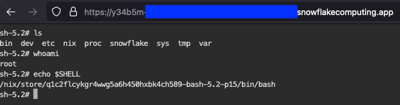

When working with containers it's useful to have a proper shell inside the
environment for debugging or general research purposes. This repository contains
the package definition and a Github action that creates and pushes a container
with bash as a webshell:



# How to

There are two sample images provided:

- Nix-based one
- [Debian-based one](./non-nix/Dockerfile)

The instructions below could be applied to either one of them

## Initial setup

Follow the [common setup](https://docs.snowflake.com/developer-guide/snowpark-container-services/tutorials/common-setup)
tutorial to have the image repository and a compute pool in your account.

## With Github actions

Short version:

1. Clone/copy this repository
2. Set up a dedicated CI/CD user:

    ```sql
    USE ROLE useradmin;
    CREATE OR REPLACE ROLE spcs_ci_cd_rl;

    -- https://docs.snowflake.com/en/sql-reference/sql/create-user
    CREATE OR REPLACE USER spcs_ci_cd_usr
    DEFAULT_ROLE = spcs_ci_cd_rl
    RSA_PUBLIC_KEY = '<publicKey>'
    -- Prevents using password and some other fields
    TYPE = SERVICE
    COMMENT = 'CI/CD user to push image and create a service'
    -- Optional: set up per-user network role
    -- NETWORK_POLICY = CI_CD_POLICY
    ;
    GRANT ROLE spcs_ci_cd_rl TO USER spcs_ci_cd_usr;

    GRANT USAGE ON DATABASE <dbName> TO ROLE spcs_ci_cd_rl;
    GRANT USAGE ON SCHEMA <dbName>.<schemaName> TO ROLE spcs_ci_cd_rl;
    -- Needs both read and write
    GRANT READ,WRITE ON IMAGE REPOSITORY <dbName>.<schemaName>.<repoName>
        TO ROLE spcs_ci_cd_rl;

    ```

3. Set up GitHub secrets for
    - `REGISTRY_URL` : value can be obtained by running `DESC IMAGE REPOSITORY
      <path>` SQL statement in Snowflake. `<path>` refers to the path to the image
      repository in Snowflake in form of `<dbName>.<schemaName>.<repoName>`. If
      following along the setup from SPCS [tutorials][tutorials], it is
      `tutorial_db.data_schema.tutorial_repository`
    - `SNOWFLAKE_USER` : user to log into repository
    - `SNOWFLAKE_ACCOUNT` : Snowflake account identifier
    - `SNOWFLAKE_PRIVATE_KEY` : private key counterpart to public key used when
      creating dedicated CI/CD user
4. Run the "Build docker archive and push it using skopeo" workflow

More background is available in [this post][ci-cd].

## Without Github actions

SPCS (at the time of writing) only works with `x86_64` images. So, on an M1
machine you would need access to a remote builder capable of building `x86_64`
packages – for example a virtual machine.

### Nix-based workflow

The nix-based image requires [`nix`](https://nixos.org/download).

1. Have `nix` available (optionally with `direnv`)
2. Clone the repository
3. Configure the environment variables:

    If using `direnv`: edit `.envrc`.

    Otherwise, define `REGISTRY_URL`, `SNOWFLAKE_USER` and `SNOWFLAKE_PASSWORD`
    variables

4. Run `nix run <pathToClonedRepo>#buildAndPushToSpcs -- "ttydContainer"`

### Docker-based workflow

Change directory to `./non-nix/` and follow the "Build image and upload" steps
from [Snowpark container services
tutorial](https://docs.snowflake.com/en/developer-guide/snowpark-container-services/tutorials/tutorial-1#build-an-image-and-upload).

## Final steps

After the image has been pushed to Snowflake (through action or from local
machine).

1. Create the service:

    ```SQL
    CREATE SERVICE <serviceName>
    IN COMPUTE POOL <computePoolName>
    FROM SPECIFICATION $$
    spec:
      containers:
        - name: <container_name>
          image: /<database>>/<schema>/<registry_name>/<containerTag>:latest
          command:
            - "ttyd"
            - "--port=8000"
            - "--writable"
            - "sh"
      endpoints:
        - name: ttyd
          port: 8000
          public: true
    $$;
    ```

    where `<containerTag>` is `nix-ttydcontainer` or `ttydcontainer`. Check
    action logs for the specific value.

2. Wait for endpoints provisioning to complete (you can monitor the output of
   `SHOW ENDPOINTS IN SERVICE <serviceName>`)
3. Open the `ttyd` endpoint URL

# Creating the service

```sql
# If intending to run nix shells:
USE ROLE ACCOUNTADMIN;
CREATE NETWORK RULE nix_cache
  TYPE = 'HOST_PORT'
  MODE= 'EGRESS'
  VALUE_LIST = ('api.github.com', 'codeload.github.com',
                'github.com','cache.nixos.org', 'channels.nixos.org');

CREATE EXTERNAL ACCESS INTEGRATION nix_cache_integration
ALLOWED_NETWORK_RULES = (nix_cache)
ENABLED = true;
GRANT USAGE ON INTEGRATION nix_cache_integration TO ROLE <spcsServiceRole>;

USE ROLE <spcsServiceRole>;
CREATE SERVICE <srvName>
IN COMPUTE POOL <computePoolName>
EXTERNAL_ACCESS_INTEGRATIONS = (nix_cache_integration)
FROM SPECIFICATION $$
spec:
     containers:
       - name: spcs-ttyd
         image: /<pathToImageInImageRepo>
         command:
           - "ttyd"
           - "--port=8000"
           - "--writable"
           - "bash"
         env:
            PS1: "(webshell-1) bash: "
         resources:
            limits:
              cpu: 0.3
     endpoints:
       - name: webshell-1
         port: 8000
         public: true
   $$;

```

# Packages in the container

The container comes with certain tools pre-installed (see the list in [package
definition](./packages/ttydContainer/package.nix)).

Additional packages can be temporarily pulled in as:

```shell
$ nix shell nixpkgs#hello
$ hello
Hello World!
# or
$ nix run nixpkgs#hello
Hello World!
```

This works for any package from [nixpkgs](https://search.nixos.org/) or for any
flake reference.

To add/remove a package to the container, edit the [container
definition](./packages/ttydContainer/package.nix) file and
rerun the pipeline.

# Running without Nix (general instructions)

The main mechanism through which the shell is displayed in the browser is
[ttyd](https://tsl0922.github.io/ttyd/) which can be added to any other Docker
image.

A sample Debian-based image is provided in this repo.

[ci-cd]:
https://medium.com/@vladimir.timofeenko/snowpark-container-services-ci-cd-building-and-pushing-images-2109f54eaa99
[tutorials]: https://docs.snowflake.com/en/developer-guide/snowpark-container-services/overview-tutorials
