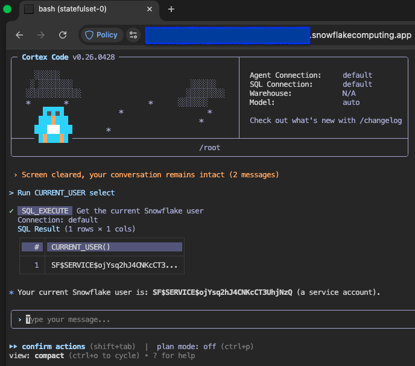

# Cortex in Snowpark Container Services 

This directory contains a toolkit for running [Cortex Code CLI][coco] in
Snowpark Container Services (SPCS) container.

# How it works

This directory contains:

1. A package definition (`./package.nix`) for installing Cortex Code in a
   nix-managed environment
2. A helper application to create `connections.toml` from SPCS environment
3. A CI app to update cortex versions in the repo

## Step by step
Run the base `ttyd` image (see README at the top of the repo).

1. Execute `nix run --no-write-lock-file
   github:sfc-gh-vtimofeenko/spcs-ttyd?dir=demos/coco-in-spcs#mk-connections-toml`
   to generate `connections.toml` file in the location `cortex` expects it.

2. Run `nix run --no-write-lock-file github:sfc-gh-vtimofeenko/spcs-ttyd?dir=demos/coco-in-spcs` to launch `cortex`

# How to use this outside nix-managed environments

If you want to integrate `cortex` into your image, you will need to procure the
package for your base image distribution. See [the install doc][install] for
hints. For establishing the connection, you may use `envsubst` in a manner
similar to the application defined in `./flake.nix`. The core logic is described
in [this Snowflake documentation article][spcs-connect].

[coco]: https://docs.snowflake.com/en/user-guide/cortex-code/cortex-code-cli
[install]: https://docs.snowflake.com/en/user-guide/cortex-code/cortex-code-cli#install-cortex-code-cli
[spcs-connect]: https://docs.snowflake.com/en/developer-guide/snowpark-container-services/spcs-execute-sql#using-snowflake-provided-service-user-credentials
